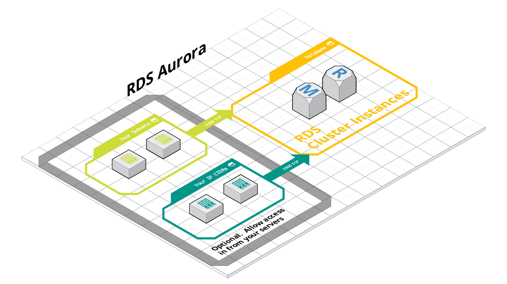

:warning: **Breaking Changes In 0.0.1**
- **This is the first version of aws-aurora-postgresql-tf module which was based of the original aws-aurora-tf module.**

## Purpose

This module allows you to simply start up or tear down a **RDS Aurora PostgreSQL Database** to be able to create global, single region provisioned, or serverless clusters.

---
## This module creates the following resources:

- RDS Aurora PostgreSQL cluster
- RDS Aurora PostgreSQL instances or zero instance on the Global Secondary cluster when setting up pilot-light disaster recovery approach.
- RDS Aurora PostgreSQL Custom DB Parameter Group
- RDS Aurora PostgreSQL Custom DB Cluster Parameter Group
- Security group allowing access to that instance
- IAM DB Authentication
- Import Data From S3 or Export Data To S3 for Aurora PostgreSQL
- IAM Role and Policy for Enhanced Monitoring
- Events Subscriptions

## Upgrading from an older release with an offline process
> 1. Take an [Aurora snapshot](https://docs.aws.amazon.com/AmazonRDS/latest/AuroraUserGuide/USER_CreateSnapshotCluster.html). 
> 2. Run 'Tear down infrastructure with terraform destroy' in HAL on the existing RDS Aurora PostgreSQL cluster.
> 3. Update the terraform.tfvars on the terragrunt_source to reference the desired release of this module. 
> 4. Update the terraform.tfvars, set the `snapshot_identifier` variable to the snapshot ARN taken on Step 1.
> 5. Update the terraform.tfvars, set 'master_username' as 'root' if your current master_username is not one of the required standard master usernames (root or administrator) to by-pass the validation error. AWS does not allow to change master username currently, and your master username will be same as before due to we use snapshot to restore the cluster.
> 6. Update the terraform.tfvars with all desired variables, please reference the [inputs table](#inputs) for more information.
> 7. Then 'Start Build' the RDS Cluster from Hal. 

## Upgrading from 7.x release of aws-aurora-tf with an online process

Please read this [document](./docs/upgrade-to-this-module-0.0.1.md).

## Example Project

See example `tfvars` in the [examples](./examples) directory, and use it in a project following the
[terraform-starter-kit](https://git.rockfin.com/terraform/terraform-starter-kit) structure.

For Beta and Prod it is now required to provide KMS key arn. KMS can be created using [KMS module](https://git.rockfin.com/terraform/aws-kms-tf). After the KMS is created provide the **kms_key_arn** in terraform.tfvars.  

[Read More about KMS and RDS Here](https://aws.amazon.com/blogs/database/securing-data-in-amazon-rds-using-aws-kms-encryption/).

<!-- BEGIN_TF_DOCS -->

#### Requirements

| Name | Version |
|------|---------|
|  [terraform](#requirement\_terraform) | >= 1.0 |
|  [aws](#requirement\_aws) | ~> 4.0 |

#### Resources

- data source.aws_kms_key.rds_aurora (main.tf#42)
- data source.aws_subnets.selected (main.tf#53)
- data source.aws_vpc.selected (main.tf#47)

#### Providers

| Name | Version |
|------|---------|
|  [aws](#provider\_aws) | 4.61.0 |

#### Modules

| Name | Source | Version |
|------|--------|---------|
|  [aurora\_cluster\_parameter\_group](#module\_aurora\_cluster\_parameter\_group) | ./modules/aurora_cluster_parameter_group | n/a |
|  [aurora\_db\_parameter\_group](#module\_aurora\_db\_parameter\_group) | ./modules/aurora_db_parameter_group | n/a |
|  [aurora\_global](#module\_aurora\_global) | ./modules/aurora_global | n/a |
|  [aurora\_provisioned](#module\_aurora\_provisioned) | ./modules/aurora_provisioned | n/a |
|  [aurora\_serverless](#module\_aurora\_serverless) | ./modules/aurora_serverless | n/a |
|  [iam-auth](#module\_iam-auth) | ./modules/iam-auth | n/a |
|  [postgresql-iam](#module\_postgresql-iam) | ./modules/postgresql-iam | n/a |
|  [tags](#module\_tags) | git::https://git.rockfin.com/terraform/aws-tags-tf.git | 3.1.0 |

#### Inputs

| Name | Description | Type | Default | Required |
|------|-------------|------|---------|:--------:|
|  [app\_id](#input\_app\_id) | AppID of the application (from AppHub). | `string` | n/a | yes |
|  [application\_name](#input\_application\_name) | The name of the application, whether it be a service, website, api, etc. | `string` | n/a | yes |
|  [aws\_account\_id](#input\_aws\_account\_id) | The AWS account to deploy into. | `string` | n/a | yes |
|  [aws\_region](#input\_aws\_region) | The AWS region in which all resources will be created. | `string` | n/a | yes |
|  [development\_team\_email](#input\_development\_team\_email) | The development team email address that is responsible for this resource(s). | `string` | n/a | yes |
|  [environment](#input\_environment) | The environment name in which the infrastructure is located. (e.g. dev, test, beta, prod) | `string` | n/a | yes |
|  [infrastructure\_engineer\_email](#input\_infrastructure\_engineer\_email) | The infrastructure engineer email address that is responsible for this resource(s). | `string` | n/a | yes |
|  [infrastructure\_team\_email](#input\_infrastructure\_team\_email) | The infrastructure team email address that is responsible for this resource(s). | `string` | n/a | yes |
|  [master\_password](#input\_master\_password) | The password for the master user. This should typically be set as the environment variable \_TF\_master\_password so you don't check it into source control. The password must be either saved into myvault or in the AWS Secret Manager. | `string` | n/a | yes |
|  [master\_username](#input\_master\_username) | The username for the master user. This should typically be set as the environment variable \_TF\_master\_username so you don't check it into source control. | `string` | n/a | yes |
|  [vpc\_id](#input\_vpc\_id) | The id of the VPC in which this database should be deployed. | `string` | n/a | yes |
|  [allow\_connections\_from\_cidr\_blocks](#input\_allow\_connections\_from\_cidr\_blocks) | A list of CIDR-formatted IP address ranges that can connect to this DB. This is not a recommended allow list practice, please consider to use security groups. | `list(string)` | `[]` | no |
|  [allow\_connections\_from\_security\_groups](#input\_allow\_connections\_from\_security\_groups) | Specifies a list of Security Groups to allow connections from. | `list(string)` | `[]` | no |
|  [app\_tags](#input\_app\_tags) | Extra tags to apply to created resources | `map(string)` | `{}` | no |
|  [apply\_immediately](#input\_apply\_immediately) | Specifies whether any cluster modifications are applied immediately, or during the next maintenance window. Note that cluster modifications may cause degraded performance or downtime. | `bool` | `false` | no |
|  [auto\_minor\_version\_upgrade](#input\_auto\_minor\_version\_upgrade) | Indicates that minor engine upgrades will be applied automatically to the DB instance during the maintenance window. Defaults to false | `bool` | `false` | no |
|  [backup\_retention\_period](#input\_backup\_retention\_period) | Set the retention period for auto snapshot, retention period shall be at least 30 days for production and 14 days for non-production. | `number` | `null` | no |
|  [ca\_cert\_identifier](#input\_ca\_cert\_identifier) | The identifier of the CA certificate for the DB instance. | `string` | `"rds-ca-rsa2048-g1"` | no |
|  [create\_initial\_global\_cluster](#input\_create\_initial\_global\_cluster) | Used for converting a provisioned instance to global. If you are deploying this code for the first time, set this to true, otherwise set this to false. | `bool` | `false` | no |
|  [custom\_subnet\_name\_filter](#input\_custom\_subnet\_name\_filter) | The module will default to looking for subnets that were created and tagged as vpc\_id-private-pers-az* via the aws-vpc-tf VPC module.  If you did not use that module, you can specify a different tag with this variable. | `string` | `"*-private-az*"` | no |
|  [database\_name](#input\_database\_name) | The name for your database of up to 8 alpha-numeric characters. If you do not provide a name, Amazon RDS will not create a database in the DB cluster you are creating. | `string` | `""` | no |
|  [db\_user\_name](#input\_db\_user\_name) | The database user name, could be more than one here. | `list(string)` | `[]` | no |
|  [dbi\_resource\_id](#input\_dbi\_resource\_id) | The region-unique, immutable identifier for the DB instance. | `list(string)` | `[]` | no |
|  [default\_cluster\_parameters](#input\_default\_cluster\_parameters) | default customize parameter for aurora cluster parameter group provided automatically for best practices. | `list(map(string))` | <pre>[   {     "apply_method": "immediate",     "name": "rds.force_ssl",     "value": 1   },   {     "apply_method": "immediate",     "name": "ssl_min_protocol_version",     "value": "TLSv1.2"   },   {     "apply_method": "pending-reboot",     "name": "shared_preload_libraries",     "value": "pg_stat_statements,pg_cron"   } ]</pre> | no |
|  [default\_instance\_parameters](#input\_default\_instance\_parameters) | default customize parameter for aurora instance parameter group provided automatically for best practices. | `list(map(string))` | <pre>[   {     "apply_method": "immediate",     "name": "log_statement",     "value": "none"   } ]</pre> | no |
|  [deletion\_protection](#input\_deletion\_protection) | If the DB instance should have deletion protection enabled. The database can't be deleted when this value is set to true. | `bool` | `null` | no |
|  [enabled\_cloudwatch\_logs\_exports](#input\_enabled\_cloudwatch\_logs\_exports) | List of log types to export to cloudwatch. If omitted, no logs will be exported. The following log types are supported: postgresql. | `list(string)` | `[]` | no |
|  [engine](#input\_engine) | The name of the database engine to be used for the RDS instance. Must be aurora-postgresql. | `string` | `"aurora-postgresql"` | no |
|  [engine\_mode](#input\_engine\_mode) | The version of aurora to run - provisioned or serverless. | `string` | `"provisioned"` | no |
|  [engine\_version](#input\_engine\_version) | The version of the engine in var.engine to use. | `string` | `""` | no |
|  [global\_cluster\_identifier](#input\_global\_cluster\_identifier) | Global cluster identifier when creating global primary and secondary cluster | `string` | `null` | no |
|  [globalprimary\_iam\_role\_name](#input\_globalprimary\_iam\_role\_name) | The Name of IAM role from Global Primary Cluster | `string` | `""` | no |
|  [globalprimary\_iam\_roles\_arn](#input\_globalprimary\_iam\_roles\_arn) | The ARNs for the IAM roles from Global Primary Cluster. | `list(string)` | `null` | no |
|  [hal\_app\_id](#input\_hal\_app\_id) | ID of the Hal application | `string` | `null` | no |
|  [iam\_database\_authentication\_enabled](#input\_iam\_database\_authentication\_enabled) | Specifies whether mappings of AWS Identity and Access Management (IAM) accounts to database accounts is enabled. Disabled by default. | `bool` | `false` | no |
|  [iam\_role\_name](#input\_iam\_role\_name) | The Name of IAM role | `string` | `""` | no |
|  [iam\_roles](#input\_iam\_roles) | A List of ARNs for the IAM roles to associate to the RDS Cluster. | `list(string)` | `null` | no |
|  [instance\_count](#input\_instance\_count) | How many instances to launch. RDS will automatically pick a leader and configure the others as replicas. | `number` | `2` | no |
|  [instance\_type](#input\_instance\_type) | The instance type to use for the db (For production, we recommend to use db.r5.x). | `string` | `"db.t3.medium"` | no |
|  [is\_primary](#input\_is\_primary) | Determines whether to create the global clutser or not. If true creates the global cluster and primary else creates only secondary for global clusters | `bool` | `false` | no |
|  [is\_secondary](#input\_is\_secondary) | Determines whether to create the global secondary clutser or not. If true creates secondary for global clusters | `bool` | `false` | no |
|  [kms\_key\_arn](#input\_kms\_key\_arn) | The ARN of a KMS key that should be used to encrypt data on disk. Only used if var.storage\_encrypted is true. If you leave this blank, the default RDS KMS key for the account will be used. | `string` | `null` | no |
|  [lambda\_arn](#input\_lambda\_arn) | The ARN of the lambdas that will be exectued through Aurora DB. | `list(string)` | `null` | no |
|  [module\_source](#input\_module\_source) | The source of the terraform module.  Automatically populated by HAL. | `string` | `""` | no |
|  [module\_version](#input\_module\_version) | The version of the terraform module.  Automatically populated by HAL. | `string` | `""` | no |
|  [monitoring\_interval](#input\_monitoring\_interval) | The interval, in seconds, between points when Enhanced Monitoring metrics are collected for the DB instance. To disable collecting Enhanced Monitoring metrics, specify 0. The default is 0.  Allowed values: 0, 1, 5, 15, 30, 60 | `number` | `0` | no |
|  [monitoring\_role\_arn](#input\_monitoring\_role\_arn) | Custom role to use for monitoring. By default if left blank a role will be created using the AmazonRDSEnhancedMonitoringRole policy. | `string` | `null` | no |
|  [parameter\_family\_name](#input\_parameter\_family\_name) | The family of the DB cluster parameter group. Leave blank to use the default parameter group. | `string` | `"aurora-postgresql13"` | no |
|  [performance\_insights\_enabled](#input\_performance\_insights\_enabled) | Enable performance insights. | `bool` | `false` | no |
|  [performance\_insights\_retention\_period](#input\_performance\_insights\_retention\_period) | Amount of time in days to retain Performance Insights data. Valid values are 7, 731 (2 years) or a multiple of 31.Default to 7 day as it is free. | `number` | `7` | no |
|  [pg\_iam\_features](#input\_pg\_iam\_features) | Map of features which require IAM roles for Aurora postgresql. | `map(string)` | <pre>{   "Comprehend": "False",   "Lambda": "False",   "SageMaker": "False",   "s3Export": "False",   "s3Import": "False" }</pre> | no |
|  [pilotlight\_enabled](#input\_pilotlight\_enabled) | To setup global database active-passive with a pilot-light disaster recovery approach to have zero reader instance on Secondary cluster. | `bool` | `false` | no |
|  [port](#input\_port) | The port the DB will listen on. | `number` | `5432` | no |
|  [postgres\_cluster\_parameters](#input\_postgres\_cluster\_parameters) | customize parameter for aurora cluster parameter group provided by application team. | `list(map(string))` | `[]` | no |
|  [postgres\_instance\_parameters](#input\_postgres\_instance\_parameters) | customize parameter for aurora instance parameter group. | `list(map(string))` | `[]` | no |
|  [preferred\_backup\_window](#input\_preferred\_backup\_window) | The daily time range during which automated backups are created (e.g. 04:00-09:00). Time zone is UTC. Performance may be degraded while a backup runs. | `string` | `"06:00-07:00"` | no |
|  [preferred\_maintenance\_window](#input\_preferred\_maintenance\_window) | The weekly day and time range during which system maintenance can occur (e.g. wed:04:00-wed:04:30). Time zone is UTC. Performance may be degraded or there may even be a downtime during maintenance windows. | `string` | `"sun:07:00-sun:08:00"` | no |
|  [prefix](#input\_prefix) | Add additional prefix to beginning of resource names. | `string` | `""` | no |
|  [publicly\_accessible](#input\_publicly\_accessible) | As enterprise standard, RDS should not be publicly accessible. The variable currently is locked as false. Only exist to make sure backward compatibility. | `bool` | `false` | no |
|  [retention\_in\_days](#input\_retention\_in\_days) | Define the retention period of postgresql log. | `number` | `7` | no |
|  [scaling\_auto\_pause](#input\_scaling\_auto\_pause) | Whether to enable automatic pause. A DB cluster can be paused only when it's idle (it has no connections). If a DB cluster is paused for more than seven days, the DB cluster might be backed up with a snapshot. In this case, the DB cluster is restored when there is a request to connect to it. | `bool` | `true` | no |
|  [scaling\_max\_capacity](#input\_scaling\_max\_capacity) | The maximum capacity. The maximum capacity must be greater than or equal to the minimum capacity. Valid capacity values are 2, 4, 8, 16, 32, 64, 192, and 384. | `number` | `384` | no |
|  [scaling\_min\_capacity](#input\_scaling\_min\_capacity) | The minimum capacity. The minimum capacity must be lesser than or equal to the maximum capacity. Valid capacity values are 2, 4, 8, 16, 32, 64, 192, and 384. | `number` | `2` | no |
|  [scaling\_seconds\_until\_auto\_pause](#input\_scaling\_seconds\_until\_auto\_pause) | The time, in seconds, before an Aurora DB cluster in serverless mode is paused. Valid values are 300 through 86400 (24 hours). | `number` | `300` | no |
|  [skip\_final\_snapshot](#input\_skip\_final\_snapshot) | Determines whether a final DB snapshot is created before the DB instance is deleted. Be very careful setting this to true; if you do, and you delete this DB instance, you will not have any backups of the data! | `bool` | `false` | no |
|  [snapshot\_identifier](#input\_snapshot\_identifier) | This is the field need to be configured when we do a cluster rebuild for iac upgrade. This is the Snapshot ID you'd find in the RDS console, e.g: rds:production-2015-06-26-06-05. | `string` | `null` | no |
|  [source\_region](#input\_source\_region) | Source region for global secondary cluster | `string` | `null` | no |
|  [storage\_encrypted](#input\_storage\_encrypted) | Specifies whether the DB cluster uses encryption for data at rest in the underlying storage for the DB, its automated backups, Read Replicas, and snapshots. Uses the default aws/rds key in KMS. | `bool` | `true` | no |
|  [subnet\_ids](#input\_subnet\_ids) | A (optional) list of subnet ids where the database instances should be deployed. If you leave this null instances will be deployed in private-persistence subnets. | `list(string)` | `null` | no |
|  [suffix](#input\_suffix) | Add additional suffix to end of resource names. | `string` | `""` | no |

#### Outputs

| Name | Description |
|------|-------------|
|  [burstable](#output\_burstable) | To identify the memory optimized instances |
|  [cluster\_arn](#output\_cluster\_arn) | ARN of the cluster |
|  [cluster\_endpoint](#output\_cluster\_endpoint) | Primary endpoint of the cluster |
|  [cluster\_id](#output\_cluster\_id) | ID of the cluster |
|  [database\_name](#output\_database\_name) | Primary database name |
|  [db\_user\_name](#output\_db\_user\_name) | The user you assigned to do IAM DB Auth |
|  [dbi\_resource\_id](#output\_dbi\_resource\_id) | Unique resource ID assigned to the instance |
|  [instance\_endpoints](#output\_instance\_endpoints) | List of endpoints containing each instance |
|  [instance\_type](#output\_instance\_type) | Instance types comprise varying combinations of CPU, memory, storage, and networking capacity and give you the flexibility to choose the appropriate mix of resources for your applications. |
|  [port](#output\_port) | Database port |
|  [reader\_endpoint](#output\_reader\_endpoint) | Endpoint of the read replica |
|  [security\_group\_id](#output\_security\_group\_id) | Security group attached to the RDS instances |
|  [subnet\_ids](#output\_subnet\_ids) | Subnet ids that can connect to the db instance. |

<!-- END_TF_DOCS -->

## Parameter Groups:

You can manage your DB engine configuration by associating your DB instances and Aurora DB clusters with parameter groups.

### Here are some important points about working with parameters in a parameter group:

When you change a dynamic parameter and save the parameter group, the change is applied immediately regardless of the Apply Immediately setting. When you change a static parameter and save the DB parameter group, the parameter change takes effect after you manually reboot the DB instance. You can reboot a DB instance using the RDS console, by calling the reboot-db-instance CLI command, or by calling the RebootDbInstance API operation. The requirement to reboot the associated DB instance after a static parameter change helps mitigate the risk of a parameter misconfiguration affecting an API call, such as calling ModifyDBInstance to change DB instance class or scale storage.

> :warning: **DISCLAIMER**:If you are changing Static parameter then your apply-method should be "pending-reboot" and for dynamic parameter should be "immediate".If an  interchanged value gets passed(static- immediate and dynamic- pending-reboot) build will fail. 

### Aurora POSTGRESQL Cluster parameter group defaults:

| Name                    | Value  | Type       | Description   
| ----------------------- | ------ | -----------|---------------
| rds\.force\_ssl          | 1      | Dynamic    | Force SSL connections.
| ssl\_min\_protocol\_version         | TLSv1.2      | Dynamic    | Sets the minimum SSL/TLS protocol version allowed
| shared\_preload\_libraries         | pg_stat_statements,pg_cron      | Static    | These 2 shared libraries will be preloaded into server.

