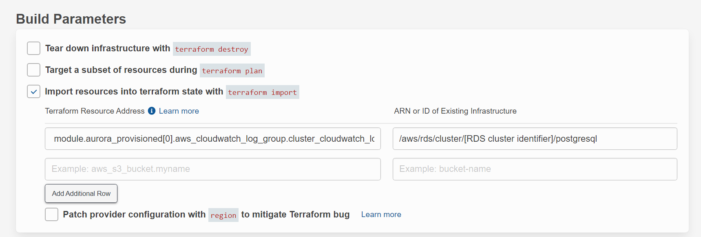
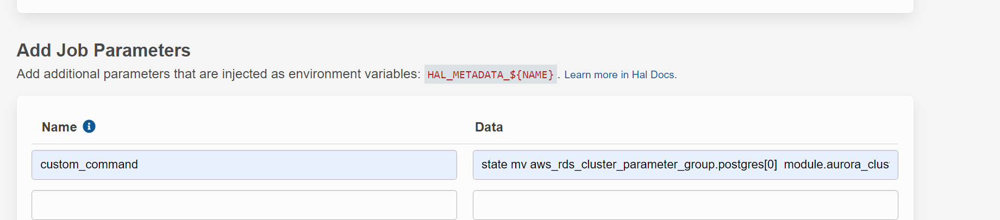

# Upgrade Existing Cluster from "aws-aurora-tf" Module to 0.0.1 Release of this Module

> This document guides team to perform an in place IAC module upgrade for existing provisioned RDS Aurora PostgreSQL cluster that provisioned with release >= 7.x of [aws-aurora-tf](https://git.rockfin.com/terraform/aws-aurora-tf) module. By switching from aws-aurora-tf to aws-aurora-postgresql-tf, the end user would adopt an automation experience explicitly build for PostgreSQL engine on RDS Aurora platform. Please refer to release note for technical details and all enhancements included in the initial release. 

## Prerequisite:
  1. If the current deployment uses a KMS Key (CMK) in tfvars that created by using the aws-kms-tf module with release <=1.6, it is necessary to upgrade and repush the KMS key module before this upgrade. This will ensure the CMK has proper default permission granted to encrypt cloudwatch logs.
  2. Before upgrade any existing cluster to the 0.0.1 release of [aws-aurora-postgresql-tf](https://git.rockfin.com/terraform/aws-aurora-postgresql-tf) module, the RDS Aurora Postgresql cluster should at least be on 7.x release of [aws-aurora-tf](https://git.rockfin.com/terraform/aws-aurora-tf) module.
  3. Even the upgrade process is mostly online and only create minimal interuption to the RDS Aurora cluster, **it is still necessary to plan and schedule a maintenance window for at least 1 hr to perform all necessary steps for this upgrade**.
  4. 0.0.1 release will swap the default value of ca_cert_identifier from "rds-ca-2019" to "rds-ca-rsa2048-g1" in order to update the RDS instance(s) on the cluster to use the latest generation of cert that support auto rotation. The current default cert "rds-ca-2019" will expired in Aug 2023. If you do not wish to apply this change in the IAC version upgrade, you can explicitly define the variable in tfvars as ca_cert_identifier = "rds-ca-2019" to override the default. Otherwise please read this [doc](https://git.rockfin.com/pages/DataOperation/db-guidebook/Aurora/RDS%20SSL%20Certificate%20Update.html) to prepare for the cert upgrade.
  5. **It is necessary to run a build(terraform plan) on the current configuration to check if there is any changes applied without using terraform. If so, apply all missing changes with current IAC pipeline before perform this upgrade.**

## Upgrade Steps:
  1. Upgrade the deployment pipeline setting to use TF 1.0.x and TG 0.35.x.
  2. If the variables "performance_insights_enabled" has been set to ``true`` and the "performance_insights_kms_key_id" has not been explicitly set to use the same CMK as variable "kms_key_arn" (used for storage encryption). For this upgrade, performance inside(PI) need to be disabled then re-enable because PI cannot be updated on the fly to use a different KMS key. "performance_insights_enabled" has to been set to ``false`` first. Variable "performance_insights_kms_key_id" should be removed from tfvars because it has been purposely removed in new module to reduce variable end users need to configure, and ensure both storage and PI encrypted with the same CMK when it is provided or use the default amazon managed key. **Disable and re-enable PI would truncate the historical PI data.**
  3. If variable "enabled_cloudwatch_logs_exports" has been set as ["postgresql"]. It is necessary to import the aws_cloudwatch_log_group resource into the tf state. This release will start to explicitly creating and managing the cloudwatch log group used by the RDS Aurora cluster for log export to ensure our enterprise tagging and retention policies. If HAL is used, follow [HAL doc](https://docs.hal.zone/terraform/importing-state/#importing-state) to import it, this require to run a build and **do not deploy this "import" build in HAL.** Here is an [example build](https://hal.zone/builds/1b307373-f466-48c9-929d-d4e1bde89362) in HAL.
  

  ```terraform
  	 terraform import module.aurora_provisioned[0].aws_cloudwatch_log_group.cluster_cloudwatch_log_group[0] /aws/rds/cluster/[RDS cluster identifier]/postgresql
  ```
  4. Need to run terraform state move on both cluster and instance parameter group resources. This release has some refactor and move the index of those resources. Use [HAL custom command](https://docs.hal.zone/terraform/importing-state/#using-the-api) to run state move, this require to run two separate builds for each state move and **do not deploy those "state mv" builds in HAL.** Here is an [example build](https://hal.zone/builds/1b304c68-7eac-41ba-bf1e-ef3ae34b63ae) in HAL. Configure HAL build for each state move with "add job parameters". The data field do not need to include ``terraform`` keyword.


  ```terraform
  	
     terraform state mv aws_rds_cluster_parameter_group.postgres[0]  module.aurora_cluster_parameter_group.aws_rds_cluster_parameter_group.selected

     terraform state mv aws_db_parameter_group.postgres[0] module.aurora_db_parameter_group.aws_db_parameter_group.selected
  ```
  5. Run a new build, if "pg_iam_features" is set with a non-default value then we can expect to see destroy and recreate on a few ``aws_iam_role, aws_iam_policy, aws_iam_role_policy_attachment, aws_s3_bucket and aws_rds_cluster_role_association`` resources due to index rename.Two new resources could be created, ``aws_s3_bucket_server_side_encryption_configuration and time_sleep``, those are due to propagation dependcy logic rewrite and decom deprecated configuration in tf resource. Here is an [example build](https://hal.zone/builds/1b30dc11-52f0-48ce-9488-e272b8f10bce) in HAL. (We could run multiple state move builds on those recreated resources or use moved code block in terraform module, however since they are not blocking the upgrade proces and does not create major downtime, to keep process simple we just let the terraform deployment to take care them.)
  6. Deploy the build for this upgrade process to complete.
  7. If you have to disable PI in step 2, re-enable it in tfvars and run a new build/deploy to turn PI back on with the proper encryption key setting.